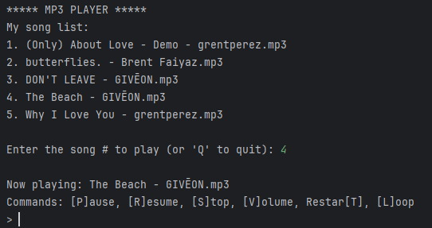
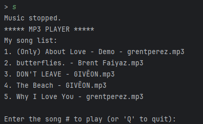

# Python Music Player
Python Music Player is a simple Python program (strictly Windows) that can be used to play whatever music files (mp3) you have. I've decided to go on a little Python journey so expect more projects like this!

### 
### 

## How to use it
Download and unzip the 'musicplayer.zip'. Then, add whatever mp3 files you want to play into the 'music' file. I added some of my favorite songs in there to test the music player. Finally, run the executable and try out all the different commands!
